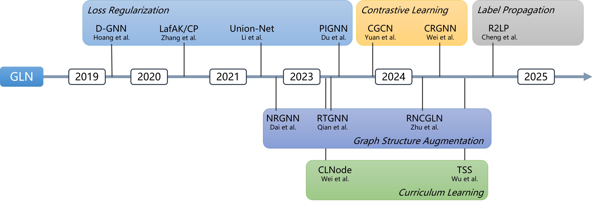

<div align="center">


</div>


------

# NoisyGL

Official code for [NoisyGL: A Comprehensive Benchmark for Graph Neural Networks under Label Noise]. NoisyGL is a comprehensive benchmark for **Graph Neural Networks under label noise(GLN)**. 
GLN is a family of data-centric learning approaches designed to jointly optimize the graph structure and the corresponding Graph Neural Network (GNN) models, with a particular focus on performance in the presence of label noise. GLN has great potential in various real-world applications, including social network analysis, biological network analysis, recommendation systems, and more. By effectively handling label noise, GLN provides more robust and accurate graph data learning capabilities, significantly enhancing graph analysis tasks in complex data environments.

## Overview of the Benchmark
NoisyGL provides a fair and comprehensive platform to evaluate existing LLN and GLN works and facilitate future GLN research.



## Installation
<!--
[PyTorch](https://pytorch.org/get-started/previous-versions/)
[PyTorch Geometric, PyTorch Sparse](https://data.pyg.org/whl/)
[DEEP GRAPH LIBRARY (DGL)](https://data.dgl.ai/wheels/repo.html)
-->
**Note:** NoisyGL depends on [PyTorch](https://pytorch.org/), [PyTorch Geometric](https://pytorch-geometric.readthedocs.io/en/latest/install/installation.html), [PyTorch Sparse](https://github.com/rusty1s/pytorch_sparse) and [DEEP GRAPH LIBRARY (DGL)](https://www.dgl.ai/pages/start.html). To streamline the installation, NoisyGL does **NOT** install these libraries for you. Please install them from the above links for running NoisyGL:

- torch>=2.0.0
- torch_geometric>=2.1.0
- torch_sparse>=0.6.12
- dgl>=0.9.0

**Installing with Conda**
``` bash
conda create -n GNNwithLabelNoise python=3.9
conda activate GNNwithLabelNoise
pip install -r requirements.txt
```


#### Required Dependencies:
- Python 3.9+
- pandas
- scipy
- scikit-learn
- ruamel 
- ruamel.yaml
- pyro-api
- pyro-ppl
- numba
- nni

## Quick Start
Run the code with the following example commands:<br>
###  Uniform Noise with noise rate 0.1 on Cora with GCN
``` bash
python total_exp.py --runs 10 --methods gcn --datasets cora --noise_type uniform --noise_rate 0.1 --device cuda:0 --seed 3000 --ignore_warnings True
```

**method** ： 
`gcn`, `smodel`, `forward`, `backward`, `coteaching`, `sce`, `jocor`, `apl`, `dgnn`, `cp`, `nrgnn`, `unionnet`, `rtgnn`, `clnode`, `cgnn`, `pignn`, `rncgln`, `crgnn`

**dataset** ： 
`cora`, `citeseer`, `pubmed`, `amazoncom`, `amazonpho`, `dblp`, `blogcatalog`, `flickr`

| Dataset          | # Nodes | # Edges | # Feat. | # Classes | # Homophily | Avg. # degree |
|------------------|---------|---------|---------|-----------|-------------|---------------|
| Cora             | 2,708   | 5,278   | 1,433   | 7         | 0.81        | 3.90          |
| Citeseer         | 3,327   | 4,552   | 3,703   | 6         | 0.74        | 2.74          |
| Pubmed           | 19,717  | 44,324  | 500     | 3         | 0.80        | 4.50          |
| Amazon-Computers | 13,752  | 491,722 | 767     | 10        | 0.78        | 35.76         |
| Amazon-Photos    | 7,650   | 238,162 | 745     | 8         | 0.83        | 31.13         |
| DBLP             | 17,716  | 105,734 | 1,639   | 4         | 0.83        | 5.97          |
| BlogCatalog      | 5,196   | 343,486 | 8,189   | 6         | 0.40        | 66.11         |
| Flickr           | 7,575   | 239,738 | 12,047  | 9         | 0.24        | 63.30         |

**noise type** ： 
`clean`, `pair`, `uniform`

## Citation

## Reference
#### LLN:
| **ID** | **Paper**                                                                                                                | **Method**  | **Conference** |
|--------|--------------------------------------------------------------------------------------------------------------------------|:-----------:|:--------------:|
| 1      | [Training deep neural-networks using a noise adaptation layer](https://openreview.net/pdf?id=H12GRgcxg)                  |   S-model   |   ICLR 2017    |
| 2      | [Making deep neural networks robust to label noise: A loss correction approach](https://arxiv.org/pdf/1609.03683)        |   Forward   |   CVPR 2017    | 
| 3      | [Making deep neural networks robust to label noise: A loss correction approach](https://arxiv.org/pdf/1609.03683)  |  Backward   |   CVPR 2017    | 
| 4      | [Co-teaching: Robust training of deep neural networks with extremely noisy labels](https://arxiv.org/pdf/1804.06872)     | Co-teaching | NeurIPS 2018,  |
| 5      | [Symmetric Cross Entropy for Robust Learning With Noisy Labels](https://arxiv.org/pdf/1908.06112)                        |     SCE     |   ICCV 2019    |
| 6      | [Combating Noisy Labels by Agreement: A Joint Training Method with Co-Regularization](https://arxiv.org/pdf/2003.02752) |    JoCoR    |   CVPR 2020    |
| 7      | [Normalized Loss Functions for Deep Learning with Noisy Labels](https://proceedings.mlr.press/v119/ma20c/ma20c-supp.pdf) |     APL     |   PMLR 2020    |

#### GLN:
| **ID** | **Paper** | **Method** | **Conference** |
|--------|---------|:----------:|:--------------:|
| 1      | [Learning Graph Neural Networks with Noisy Labels](https://arxiv.org/abs/1905.01591)      |   D-GNN    |   ICLR 2019    |
| 2      | [Adversarial label-flipping attack and defense for graph neural networks](https://ieeexplore.ieee.org/document/9338299) |  LafAK/CP  |   ICDM 2020    |
| 3      | [NRGNN: Learning a Label Noise Resistant Graph Neural Network on Sparsely and Noisily Labeled Graphs](https://dl.acm.org/doi/10.1145/3447548.3467364)  |   NRGNN    |    KDD 2021    |
| 4      | [Unified Robust Training for Graph Neural Networks Against Label Noise](https://link.springer.com/chapter/10.1007/978-3-030-75762-5_42)  | Union-Net  |  PAKDD 2021  |
| 5      | [Robust training of graph neural networks via noise governance](https://dl.acm.org/doi/abs/10.1145/3539597.3570369)  |   RTGNN    | WSDM 2023 |
| 6      | [CLNode: Curriculum Learning for Node Classification](https://dl.acm.org/doi/10.1145/3539597.3570385)  |   CLNode   |   WSDM 2023  |
| 7      | [Learning on Graphs under Label Noise](https://ieeexplore.ieee.org/abstract/document/10096088/)  |    CGNN    |   ICASSP 2023    |
| 8      | [Noise-robust Graph Learning by Estimating and Leveraging Pairwise Interactions](https://openreview.net/forum?id=r7imkFEAQb) |   PIGNN    |   TMLR 2023    |
| 9      | [Robust Node Classification on Graph Data with Graph and Label Noise](https://ojs.aaai.org/index.php/AAAI/article/view/29668)  |   RNCGLN   |  AAAI 2024  |
| 10     | [Contrastive learning of graphs under label noise](https://www.sciencedirect.com/science/article/pii/S0893608024000273)  |   CRGNN    |    Neural Netw. 2024


