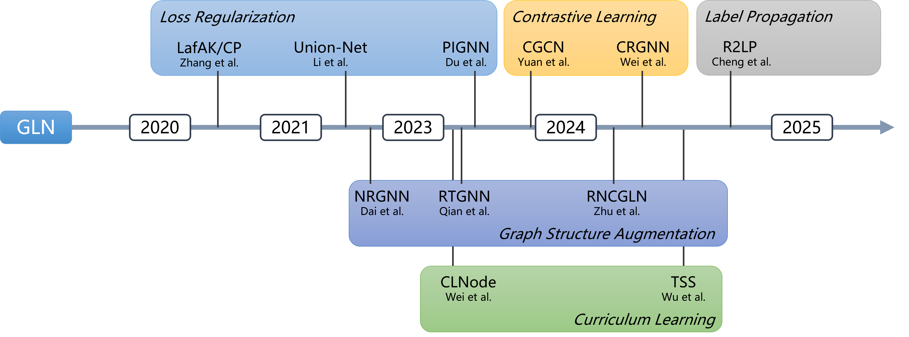

<div align="center">


</div>


------

# NoisyGL

Official code for [NoisyGL: A Comprehensive Benchmark for Graph Neural Networks under Label Noise](https://arxiv.org/abs/2406.04299) accepted by NeurIPS 2024. 
NoisyGL is a comprehensive benchmark for **Graph Neural Networks under Label Noise (GLN)**.
GLN is a family of robust Graph Neural Network (GNN) models, with a particular focus on performance in the presence of label noise. 

## Overview of the Benchmark
NoisyGL provides a fair and comprehensive platform to evaluate existing LLN and GLN works and facilitate future GLN research.




## Why NoisyGL ?

NoisyGL offers the following features:
 1. **A unified data loader module for diverse datasets.** You can customize the configuration file of the dataset (located in [config/_dataset](https://github.com/eaglelab-zju/NoisyGL/tree/main/config/_dataset)) to modify data splitting and preprocessing strategies. 
 2. **Generic noise injection schemes.** These schemes ([utils.labelnoise](https://github.com/eaglelab-zju/NoisyGL/blob/main/utils/labelnoise.py)), widely used in previous studies, can comprehensively evaluate the robustness of each method.
 3. **Generic Base_predictor class.** NoisyGL provides a generic implementation template and API for different GLN predictors ([predictors.Base_predictor](https://github.com/eaglelab-zju/NoisyGL/blob/main/predictor/Base_Predictor.py)). You can develop your methods by overriding specific methods.
 4. **Integrated hyperparameter optimization tool.** NoisyGL integrates Neural Network Intelligence (NNI) provided by Microsoft ([hyperparam_opt.py](https://github.com/eaglelab-zju/NoisyGL/blob/main/hyperparam_opt.py)). You can easily optimize and update hyperparameters for each method based on the instructions in the README.

The above features provide you with convenience and freedom when using our library. 
You can modify the implementation details of specific methods, 
or add new modules to implement your novel methods within the framework we provide easily.

## Installation
<!--
[PyTorch](https://pytorch.org/get-started/previous-versions/)
[PyTorch Geometric, PyTorch Sparse](https://data.pyg.org/whl/)
[DEEP GRAPH LIBRARY (DGL)](https://data.dgl.ai/wheels/repo.html)
-->
**Note:** NoisyGL depends on [PyTorch](https://pytorch.org/), [PyTorch Geometric](https://pytorch-geometric.readthedocs.io/en/latest/install/installation.html), [PyTorch Sparse](https://github.com/rusty1s/pytorch_sparse) and [PyTorch Cluster](https://github.com/rusty1s/pytorch_cluster). To streamline the installation, NoisyGL does **NOT** install these libraries for you. Please install them from the above links for running NoisyGL.

## Required Dependencies:
- Python 3.11+
- torch>=2.1.0
- pyg>=2.5.0
- torch_sparse>=0.6.18
- torch_cluster>=1.6.2
- pandas
- scipy
- scikit-learn
- ruamel 
- ruamel.yaml
- nni
- matplotlib
- numpy
- xlsxwriter

## Quick Start
###  Run comprehensive benchmark.
``` bash
python total_exp.py --runs 10 --methods gcn gin --datasets cora citeseer pubmed --noise_type clean uniform pair --noise_rate 0.1 0.2 --device cuda:0 --seed 3000
```
By running the command above, two methods 'gcn' and 'gin' will be tested 
on three datasets 'cora', 'citeseer', and 'pubmed' under different types and rates of label noise.
Each experiment will run 10 times and the total results will be saved at ./log and named by the current timestamp.
You can customize the combination of method, data, noise type, and noise rate by changing the corresponding arguments.

###  Run single experiment.
``` bash
python single_exp.py --method gcn --data cora --noise_type uniform --noise_rate 0.1 --device cuda:0 --seed 3000
```
This command runs a single experiment in debug mode and is usually used for debugging. 
By running this, detailed experiment information will be printed on the terminal, which can be used to locate the problem.

When designing your customized predictor, you can add code blocks that only execute in debug mode in the following way:
``` python
if self.conf.training['debug']:
    print("break point")
```

### Hyperparameter optimization.
``` bash
python hyperparam_opt.py --method gcn --data cora --noise_type uniform --noise_rate 0.1 --device cuda:0 --max_trial_number 20 --trial_concurrency 4 --port 8081 --update_config True
```
By running the command above, an NNI manager will run on http://localhost:8081, 
then automatically run 20 HPO trails, each trail call 'single_exp.py' with different hyperparameters. 
After all HPO trials are finished, 
a new config file with optimized hyperparameters will overwrite the original one at "./config/gcn/gcn_cora.yaml".
You can optimize hyperparameters for different methods on various datasets and noise types 
by changing the corresponding arguments. 

**Method available** : 
`gcn`, `smodel`, `forward`, `backward`, `coteaching`, `sce`, `jocor`, `apl`, `dgnn`, `cp`, `nrgnn`, `unionnet`, `rtgnn`, `clnode`, `cgnn`, `pignn`, `rncgln`, `crgnn`, `lcat`,
`r2lp`, `tss`

**Dataset available** : 
`cora`, `citeseer`, `pubmed`, `amazoncom`, `amazonpho`, `dblp`, `blogcatalog`, `flickr`, `amazon-ratings`, `roman-empire`

| Dataset          | # Nodes | # Edges | # Feat. | # Classes | # Homophily | Avg. # degree |
|------------------|---------|---------|---------|-----------|-------------|---------------|
| Cora             | 2,708   | 5,278   | 1,433   | 7         | 0.81        | 3.90          |
| Citeseer         | 3,327   | 4,552   | 3,703   | 6         | 0.74        | 2.74          |
| Pubmed           | 19,717  | 44,324  | 500     | 3         | 0.80        | 4.50          |
| Amazon-Computers | 13,752  | 491,722 | 767     | 10        | 0.78        | 35.8          |
| Amazon-Photos    | 7,650   | 238,162 | 745     | 8         | 0.83        | 31.1          |
| DBLP             | 17,716  | 105,734 | 1,639   | 4         | 0.83        | 5.97          |
| BlogCatalog      | 5,196   | 343,486 | 8,189   | 6         | 0.40        | 66.1          |
| Flickr           | 7,575   | 239,738 | 12,047  | 9         | 0.24        | 63.3          |
| Amazon-ratings	  | 24,492	 | 93,050	 | 300	    | 5	        | 0.38	       | 7.60          |
| Roman-empire	    | 22,662	 | 32,927	 | 300	    | 18	       | 0.05	       | 2.90          |

**noise type** ： 
`clean`, `pair`, `uniform`, `random (new)`

[//]: # (## Performance overview)

[//]: # ()
[//]: # (Test accuracy of LLN and GLN methods on DBLP dataset under 30% pair and uniform noise, respectively &#40;10 Runs&#41;.)

[//]: # (![performance overview DBLP]&#40;img/noise_type_DBLP.png&#41;)


## Citation
If our work could help your research, please cite: [NoisyGL: A Comprehensive Benchmark for Graph Neural Networks under Label Noise](https://arxiv.org/abs/2406.04299) 

```
@article{wang2024noisygl,
      title={NoisyGL: A Comprehensive Benchmark for Graph Neural Networks under Label Noise}, 
      author={Zhonghao Wang and Danyu Sun and Sheng Zhou and Haobo Wang and Jiapei Fan and Longtao Huang and Jiajun Bu},
      year={2024},
      eprint={2406.04299},
      archivePrefix={arXiv},
      primaryClass={cs.LG},
      url={https://arxiv.org/abs/2406.04299}, 
}
```

## Reference

### GNN:
| **ID** | **Paper**                                                                                                                | **Method** | **Conference/Journal** |
|--------|--------------------------------------------------------------------------------------------------------------------------|:----------:|:----------------------:|
| 1      | [Semi-supervised classification with graph convolutional networks](https://arxiv.org/pdf/1609.02907)                      |    GCN     |       ICLR 2017        |
| 2      | [How Powerful are Graph Neural Networks?](http://arxiv.org/abs/1810.00826)                                                |    GIN     |       ICLR 2019        |

### LLN:
| **ID** | **Paper**                                                                                                                | **Method**  | **Conference/Journal** |
|--------|--------------------------------------------------------------------------------------------------------------------------|:-----------:|:----------------------:|
| 1      | [Training deep neural-networks using a noise adaptation layer](https://openreview.net/pdf?id=H12GRgcxg)                  |   S-model   |       ICLR 2017        |
| 2      | [Making deep neural networks robust to label noise: A loss correction approach](https://arxiv.org/pdf/1609.03683)        |   Forward   |       CVPR 2017        | 
| 3      | [Making deep neural networks robust to label noise: A loss correction approach](https://arxiv.org/pdf/1609.03683)  |  Backward   |       CVPR 2017        | 
| 4      | [Co-teaching: Robust training of deep neural networks with extremely noisy labels](https://arxiv.org/pdf/1804.06872)     | Co-teaching |     NeurIPS 2018,      |
| 5      | [Symmetric Cross Entropy for Robust Learning With Noisy Labels](https://arxiv.org/pdf/1908.06112)                        |     SCE     |       ICCV 2019        |
| 6      | [Combating Noisy Labels by Agreement: A Joint Training Method with Co-Regularization](https://arxiv.org/pdf/2003.02752) |    JoCoR    |       CVPR 2020        |
| 7      | [Normalized Loss Functions for Deep Learning with Noisy Labels](https://proceedings.mlr.press/v119/ma20c/ma20c.pdf) |     APL     |       ICLR 2020        |

### GLN:
| **ID** | **Paper** | **Method** | **Conference/Journal** |
|--------|---------|:----------:|:----------------------:|
| 1      | [Adversarial label-flipping attack and defense for graph neural networks](https://ieeexplore.ieee.org/document/9338299) |  LafAK/CP  |       ICDM 2020        |
| 2      | [NRGNN: Learning a Label Noise Resistant Graph Neural Network on Sparsely and Noisily Labeled Graphs](https://dl.acm.org/doi/10.1145/3447548.3467364) |   NRGNN    |        KDD 2021        |
| 3      | [Unified Robust Training for Graph Neural Networks Against Label Noise](https://link.springer.com/chapter/10.1007/978-3-030-75762-5_42) | Union-Net  |       PAKDD 2021       |
| 4      | [Robust training of graph neural networks via noise governance](https://dl.acm.org/doi/abs/10.1145/3539597.3570369) |   RTGNN    |       WSDM 2023        |
| 5      | [CLNode: Curriculum Learning for Node Classification](https://dl.acm.org/doi/10.1145/3539597.3570385)  |   CLNode   |       WSDM 2023        |
| 6      | [Learning on Graphs under Label Noise](https://ieeexplore.ieee.org/abstract/document/10096088/)  |    CGNN    |      ICASSP 2023       |
| 7      | [Noise-robust Graph Learning by Estimating and Leveraging Pairwise Interactions](https://openreview.net/forum?id=r7imkFEAQb) |   PIGNN    |       TMLR 2023        |
| 8      | [Robust Node Classification on Graph Data with Graph and Label Noise](https://ojs.aaai.org/index.php/AAAI/article/view/29668) |   RNCGLN   |       AAAI 2024        |
| 9      | [Contrastive learning of graphs under label noise](https://www.sciencedirect.com/science/article/pii/S0893608024000273) |   CRGNN    |   Neural Netw. 2024    
| 10     | [Resurrecting label propagation for graphs with heterophily and label noise](https://dl.acm.org/doi/abs/10.1145/3637528.3671774)  |    R2LP    |        KDD 2024        |
| 11     | [Mitigating Label Noise on Graph via Topological Sample Selection](https://proceedings.mlr.press/v235/wu24ae.html)  |    TSS     |       ICML 2024        |

[//]: # (| 12     | [Learning Graph Neural Networks with Noisy Labels]&#40;https://arxiv.org/abs/1905.01591&#41;      |   D-GNN    |       ICLR 2019        |)


