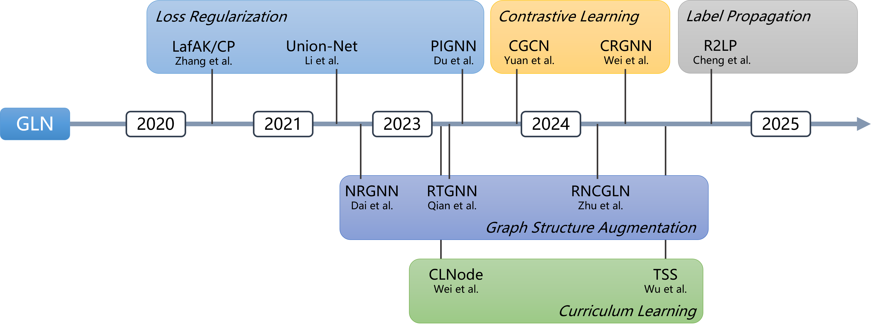

:github_url: https://github.com/eaglelab-zju/NoisyGL

NoisyGL Documentation
===================================

**NoisyGL** is a benchmark for Graph Neural Networks under Label Noise (GLN). It provides a fair and comprehensive platform to evaluate existing LLN and GLN works and facilitate future GLN research.

.. note::

   This project is under active development.

Citation
--------

If our work could help your research, we would appreciate citations to the paper:

.. code-block:: bibtex

    @inproceedings{NEURIPS2024_436ffa18,
     author = {Wang, Zhonghao and Sun, Danyu and Zhou, Sheng and Wang, Haobo and Fan, Jiapei and Huang, Longtao and Bu, Jiajun},
     booktitle = {Advances in Neural Information Processing Systems},
     editor = {A. Globerson and L. Mackey and D. Belgrave and A. Fan and U. Paquet and J. Tomczak and C. Zhang},
     pages = {38142--38170},
     publisher = {Curran Associates, Inc.},
     title = {NoisyGL: A Comprehensive Benchmark for Graph Neural Networks under Label Noise},
     url = {https://proceedings.neurips.cc/paper_files/paper/2024/file/436ffa18e7e17be336fd884f8ebb5748-Paper-Datasets_and_Benchmarks_Track.pdf},
     volume = {37},
     year = {2024}
    }
